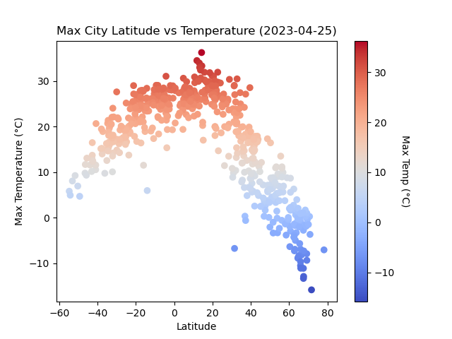
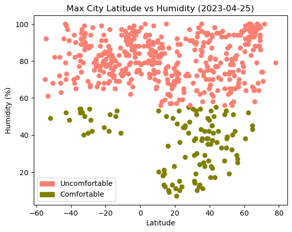
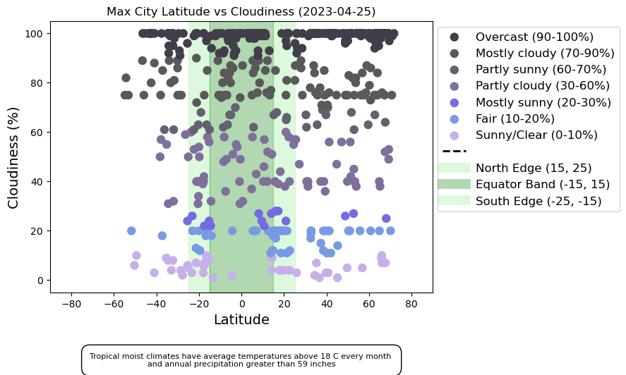
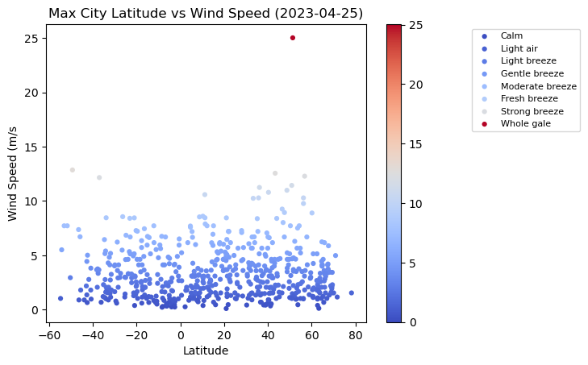
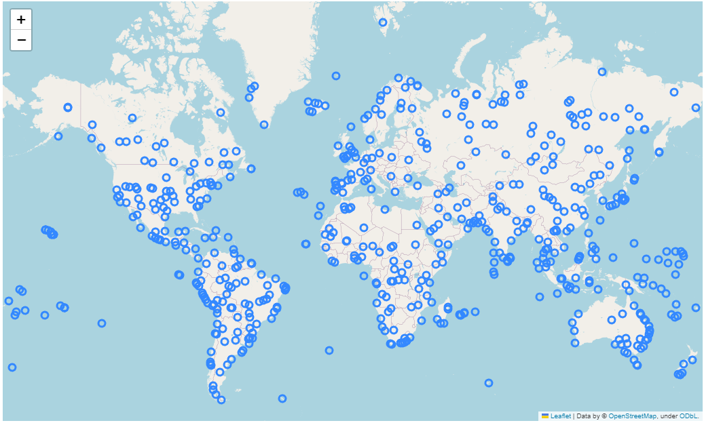
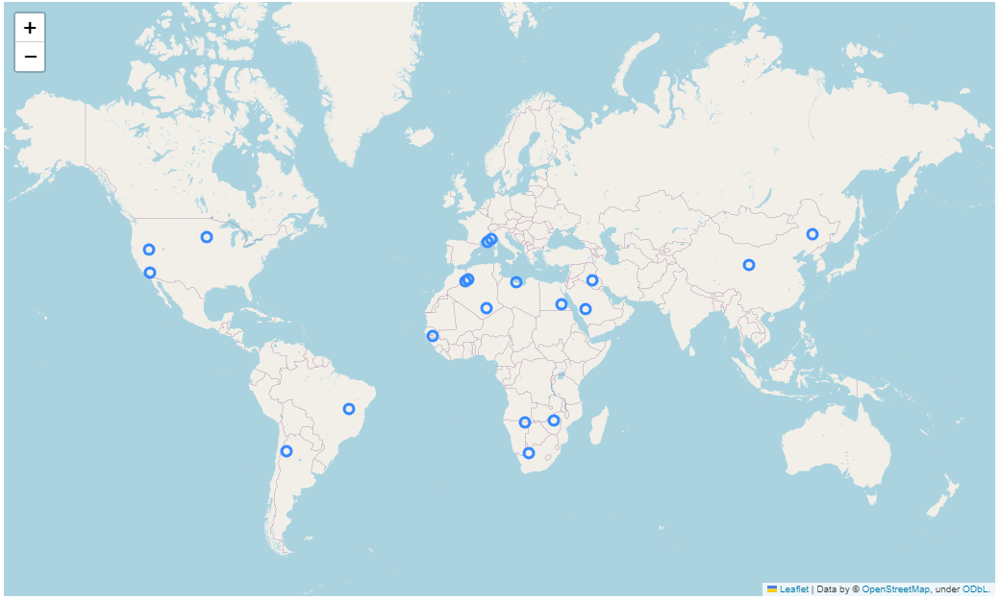

# python-api-challenge
 Python API Challenge -Alberto Ponce

# **Exploring the relationship between weather variables and latitudes of cities around the world**

**Additional Category Sources** 

>  https://www.weather.gov/arx/why_dewpoint_vs_humidity \

>  https://www.weather.gov/jetstream/climates \

>  http://gyre.umeoce.maine.edu/data/gomoos/buoy/php/variable_description.php?variable=wind_2_speed 

## VacationPy

